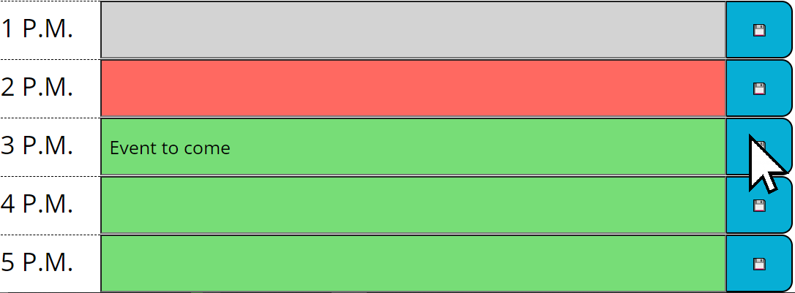
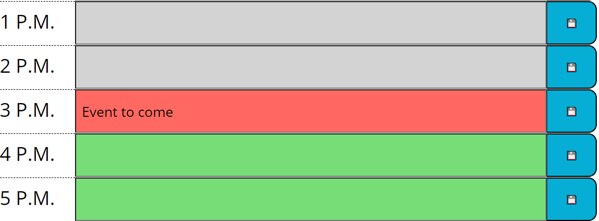

# Work Day Scheduler

## Outline

This websites stores events for each hour of a regular 9-5 workday. Users can type into the boxes and set the scheduler using the save button. The website als shows what events were missed, currently going on, or to happen using color coding. The scheduel resets each day.

